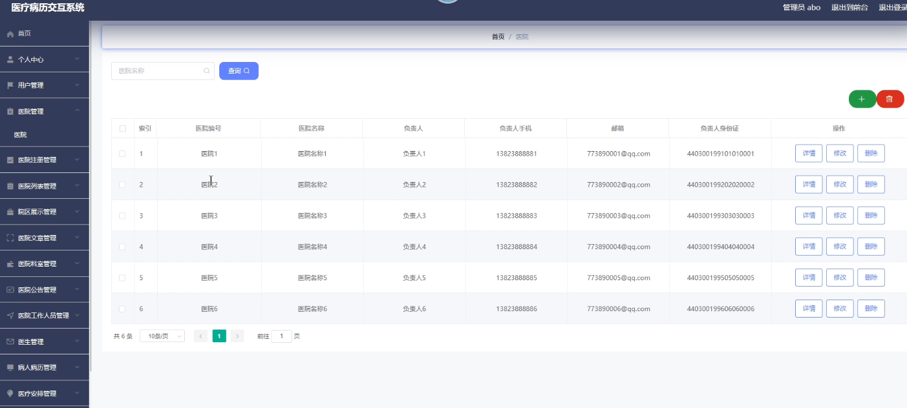
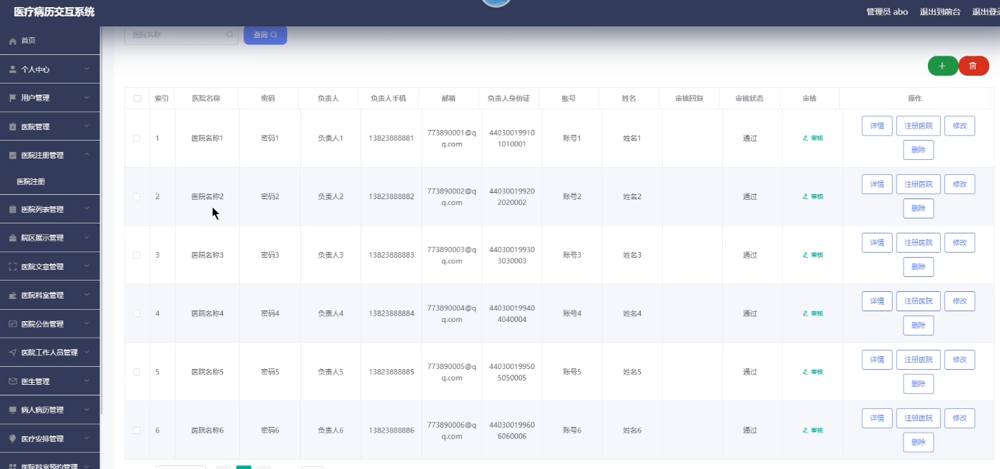
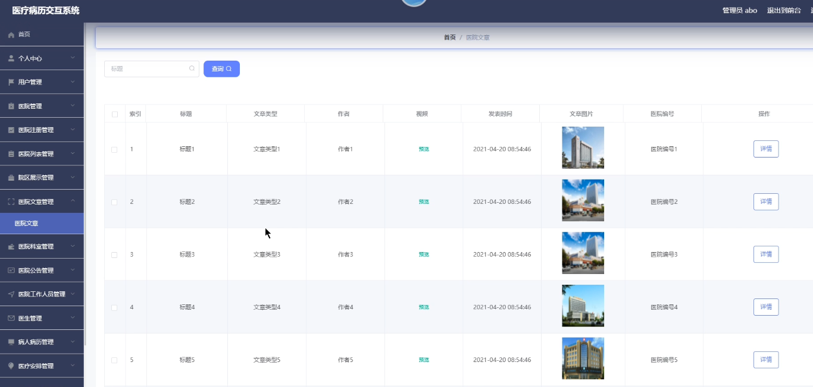
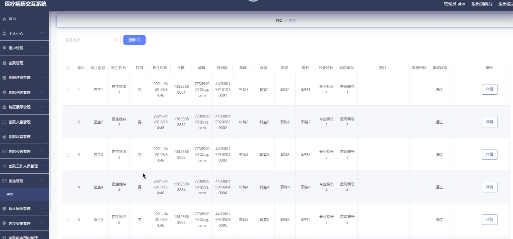
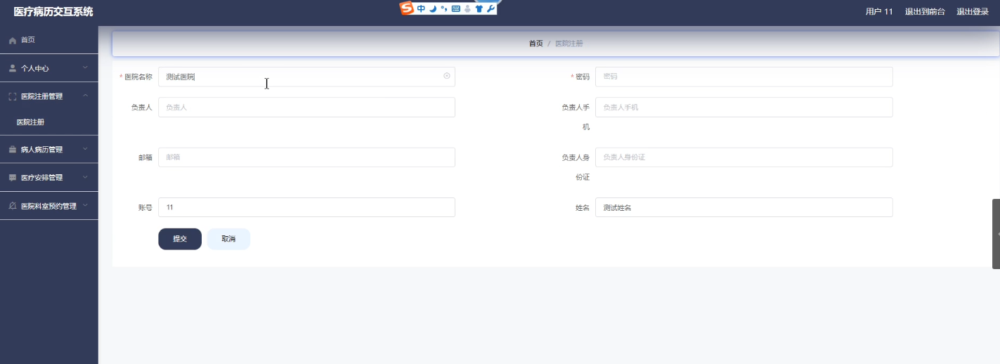
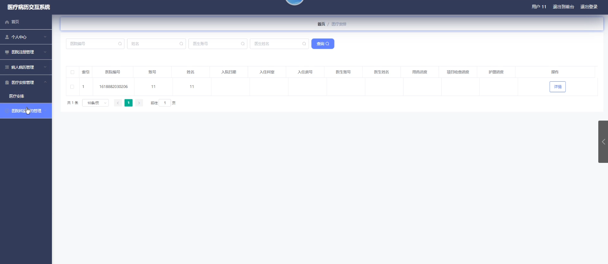
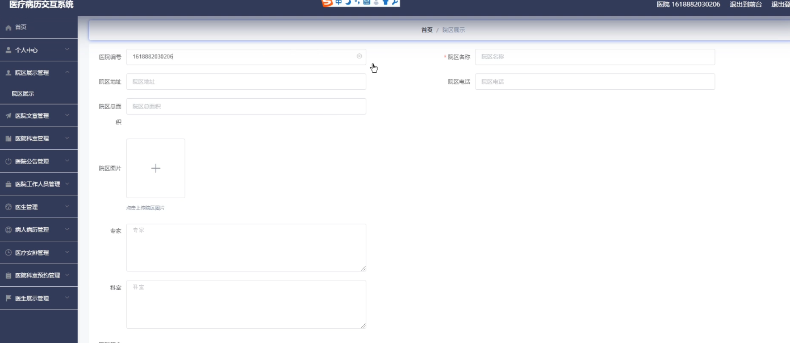
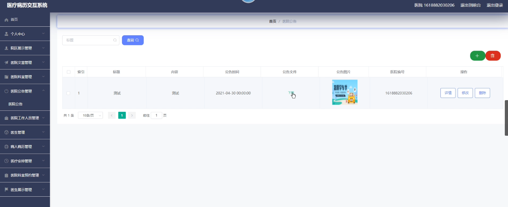
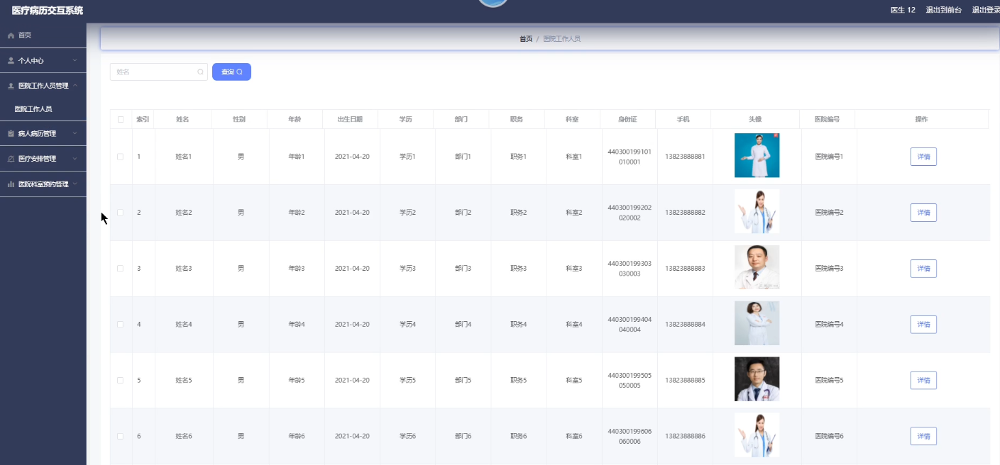
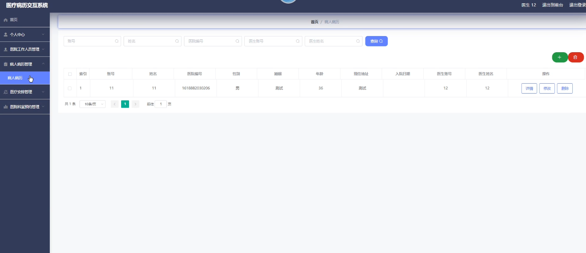

**项目简介：**  
本项目基于主流的前后端分离架构，采用 **SpringBoot + Vue 技术栈**，配套 **MySQL 数据库**，适用于毕业设计与课题实训开发。  
本人已整理了超 **4000 多套毕业设计源码+论文+开题报告+PPT...**，涵盖 **Java、SpringBoot、Vue、SSM、uni-app 小程序、PHP、Android** 等方向，支持功能修改定制与论文服务。  
**团队提供以下服务：**  
- 项目代码修改与调试  
- 数据库配置与远程协助  
- 论文定制与修改  
**获取更多的4000多套源码或SQL文件请联系：**  
- QQ：3906443360 微信：BesheHelp

## springboot061基于B2B平台的医疗病历交互系统

**项目简介：**  
本项目基于主流的前后端分离架构，采用 **SpringBoot + Vue 技术栈**，配套 **MySQL 数据库**，适用于毕业设计与课题实训开发。  
本人已整理了超 **4000 多套毕业设计源码+论文+开题报告+PPT...**，涵盖 **Java、SpringBoot、Vue、SSM、uni-app 小程序、PHP、Android** 等方向，支持功能修改定制与论文服务。  
**团队提供以下服务：**  
- 项目代码修改与调试  
- 数据库配置与远程协助  
- 论文定制与修改  
**获取更多的4000多套源码或SQL文件请联系：**  
- QQ：3906443360 微信：BesheHelp**

# 系统实现与系统测试

# 第5章 系统实现

5.1 管理员角色

5.1.1 医院管理

管理员可以在医院管理界面对医院信息进行添加，修改，删除，查询操作。医院管理页面的运行结果如图5-1所示：

图5-1医院管理界面

5.1.2 医院注册

管理员可以在医院注册界面对医院信息进行添加，修改，删除，查询操作。医院注册页面的运行结果如图5-2所示：

图5-2 医院注册界面

5.1.3 医院文章

管理员可以在医院文章界面对医院文章进行查看和查询操作。医院文章页面的运行结果如图5-3所示：

图5-3 医院文章界面

5.1.4 医生信息

管理员可以在医生信息界面对医生信息进行查看以及查询操作。医生信息页面的运行结果如图5-3所示：

图5-4 医生信息界面

5.2 用户角色

5.2.1 医院注册

用户可以在医院注册界面对注册医院信息。医院注册页面的运行结果如图5-3所示：

图5-5 医院注册界面

5.2.2 医疗安排

用户可以在医疗安排界面查看医疗安排信息。医疗安排页面的运行结果如图5-3所示：

图5-6 医疗安排界面

5.3 医院角色

5.3.1 院区注册

医院可以在院区注册界面对注册院区信息。院区注册页面的运行结果如图5-3所示：

图5-7 院区注册界面

5.3.2 医院公告

医院可以在医院公告界面对医院公告信息进行添加，修改，删除，查询等操作。医院公告页面的运行结果如图5-3所示：

图5-8 医院公告界面

5.4 医生角色

5.4.1 医院工作人员

医生可以在医院工作人员界面查看医院工作人员人员。医院工作人员页面的运行结果如图5-3所示：

图5-9 医院工作人员界面

5.4.2 病人病历

医生可以在病人病历界面对病人病历信息进行添加，修改，删除，查询等操作。病人病历页面的运行结果如图5-3所示：

图5-10 病人病历界面

第6章 程序测试与评价

6.1 程序调试

在设计系统的过程中，存在一些错误是必然的。对于语句的语法错误，在程序运行时自动提示，并请求立即纠正，因此，这类错误比较容易发现和纠正。但另一类错误是在程序执行时由于不正确的操作或对某些数据的计算公式的逻辑错误导致的错误结果。这类错误隐蔽性强，有时会出现，有时又不出现，因此，对这一类动态发生的错误的排查是耗时费力的。

6.2 程序的测试

6.2.1 测试的重要性及目的

（1）测试的重要性

在软件生命周期中，软件的测试占据着一个重要的位置，在传统的瀑布模式中，软件测试学只是处于在运行维护阶段之前，是软件产品交付给大众用户使用之前用以保证软件质量重要的一个方法。近来，软件工程界中更加趋向于一种新观点，即认为软件每一阶段中的生命周期都理应包含测试，因此使检查本阶段的成果能不能接近预期的结果目标，进而尽可能早一点发现到错误并加以改正，如果测试不是在早期阶段进行的，那么错误将延时扩散，最后常常会导致成品测试面临巨大的困难。

对于软件来讲，事实上，无论采用任何方法或者任何技术，系统中仍然会出现错误。采用新的开发方式、先进的语言、完善的开发过程，可以最大限度的降低错误的引进，但还是不能完全的杜绝软件中有可能出现的错误，这些引入的错误需要通过测试找出来，系统中错误的密度也需要通过测试来进行估量。测试是所有学科的工程的最基本的组成单元，是软件开发的一个很重要的部分。自有设计程序的那天起测试就一直伴随着。统计表明，在典型的软件开发项目中，软件测试工作量往往占软件开发总工作量的40％以上。而在软件开发的总成本中，用在测试上的开销要占30％到50％。如果把维护阶段也考虑在内，讨论整个软件生存期时，测试的成本比例也许会有所降低，但实际上维护程序的工作相当于二次开发，甚至是多次开发，其中一定又包含了很多测试的工作。

在实践中，测试软件非常困难，从而常常使我们敷衍了事或望而却步，这是因为对测试还是存在了一些错误的看法和不正确的态度，这包括:

①难以给测试的工作人员某种成就感; 认为测试工作并不像编码和设计那样容易进行发展

②在测试的过程中发现错位其实是一种对责任者工作的否定; 测试是以发现软件的错误为目标的，这是非建设性的，甚至还是具有破坏性的，

③测试的工作过程非常枯燥无味，因此不足以引起我们的兴趣和爱好;

④测试工作需要是细致而艰苦的进行;

⑤一般来说，我们都对自己编写出来的程序比较盲目的自信，在发现到错误的时候，可能会顾虑别人对我们自己开发的能力的看法。

以上这几个观点对测试系统的工作进行是尤为不利的，我们必须要端正态度、澄清认识，才可能将系统产品的质量加以提高。

（2）测试的目的

如果测试程序的目的是为了尽可能全面地找出系统中的错误，那么测试就必须直观的针对软件较为复杂的部分或者是前期出现错误比较多的位置。

①系统的测试是为了检查出错误而执行程序的运行过程;

②测试则是为了证明程序中有错误，而不是用来证明程序没有错误;

③每一个好的测试的用例是因为它能检查到至今未出现的错误;

④一个很成功的测试就是检查出了至今未能发现的错误的测试。

这种观点可以提醒人们测试要以查找错误为中心，而不是为了演示软件的正确功能。但是仅凭字面意思理解这一观点可能会产生误导，认为发现错误是软件测试的唯一目，查找不出错误的测试就是没有价值的，事实并非如此。

首先，测试并不仅仅是为了要找出错误。通过分析错误产生的原因和错误的分布特征，可以帮助项目管理者发现当前所采用的软件过程的缺陷，以便改进。同时，这种分析也能帮助我们设计出有针对性地检测方法，改善测试的有效性。其次，没有检查出错误的测试也有它的价值，完整的测试是测试质量评定的一种方式。

6.2.2 测试的步骤

类似系统开发的过程，测试工作的过程也需要分步骤来进行，每个步骤在逻辑上是前一个步骤的继续。大型系统软件一般是由若干个子系统而组成的，每一个子系统又是由若干个小的模块组成的。因此，大型系统软件的测试功过基本上由下面的几个步骤组成：

（1）模块测试 在对模块进行的测试工作步骤中所发现的经常是详细设计和编码的错误。

